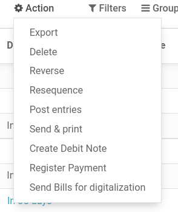
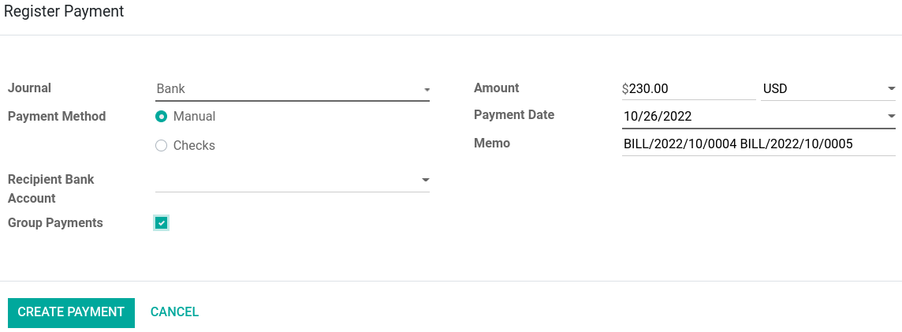

=========================
Pay several bills at once
=========================

Odoo offers the possibility to group up multiple bills' payments into one, facilitating the
reconciliation process.

.. seealso::
   - :doc:`../supplier_bills/manage`
   - :doc:`../../bank/reconciliation/use_cases`

Group payments
==============

To register the payment of multiple bills at once, go to :menuselection:`Vendors --> Bills`. Then,
select the bills you wish to register a payment for by **ticking** the boxes next to the bills. When
done, either click :guilabel:`Register Payment` or :menuselection:`Action --> Register Payment`.

When registering the payments, a **pop-up window** appears. From here, you can either create
**separate payments** for each bills all at once by clicking :guilabel:`Create Payment`, *or* you
can create one payment combining **all** bills' payments. To **combine** all payments, tick the
:guilabel:`Group Payments` box.

When selecting :guilabel:`Group Payments`, the :guilabel:`amount, currency, date and memo` are all
set automatically, but you can modify them according to your needs.

Partial group payments with cash discounts
------------------------------------------

In case of **partial group payments with cash discounts**, you can follow the steps found on the
:doc:`cash discount documentation page <../../receivables/customer_invoices/cash_discounts>`. Make
sure to apply the :doc:`payment terms <../../receivables/customer_invoices/payment_terms>` to the
**bills** *instead* of the invoices.

.. seealso::
   :doc:`../../receivables/customer_invoices/payment_terms`