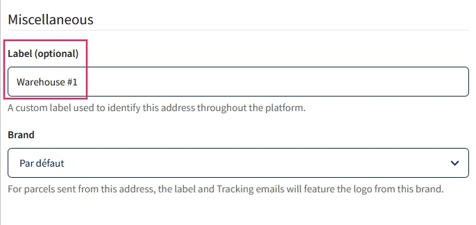
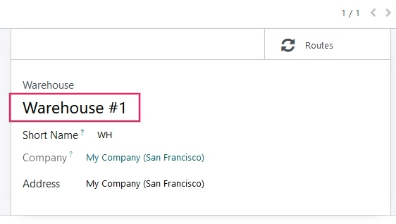
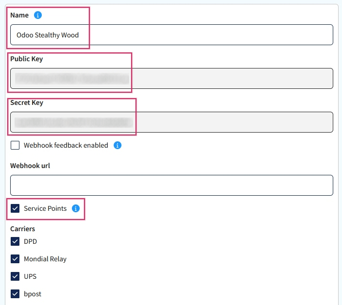
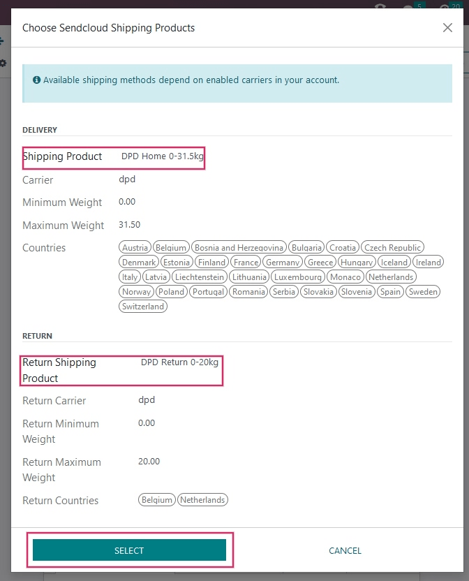

======================================================
Setup of Sendcloud shipping services in Odoo Inventory
======================================================

Odoo's compatibility with Sendcloud expands the amount of available shipping options. Sendcloud is
a :guilabel:`shipping connectors aggregator`. It facilitates the integration of the most popular
European shipping carriers in one, easy-to-use tool.

Here's `Sendcloud's documentation <https://support.sendcloud.com/hc/en-us/articles/360059470491-
Odoo-integration>`_ on setting up the integration.

.. note::
    Odoo integration of Sendcloud won't work on free plans of Sendcloud.

Setup in Sendcloud
==================

Create an account and activate carriers
---------------------------------------

To get started, go to `Sendcloud's platform <https://www.sendcloud.com>`_ to configure the account
and generate the connector credentials. Log in with the Sendcloud account.

If you don't have a Sendcloud account, fill in the :guilabel:`contact information` and
:guilabel:`payment details`. A bank account is all that's needed to set up an account. After
completing the account set up, activate (or deactivate) the :guilabel:`shipping carriers`
that Odoo will be shipping from.

Warehouse configuration
-----------------------

Once the account is created, set up the :guilabel:`Warehouse Address`. To do that, start in the
Sendcloud account, go to :guilabel:`Settings`, scroll down to :guilabel:`Shipping`, and select
:guilabel:`Addresses`. This is where  the :guilabel:`Warehouse address` should be entered.

.. image:: sendcloud_shipping/settings-shipping.png
   :align: center
   :alt: Adding addresses in the Sendcloud settings.

.. note::
    Sendcloud will also ask for a :guilabel:`VAT number`.

If the company would like Sendcloud to process the returns as well, a :guilabel:`Return Address`
will be required. Under the :guilabel:`Miscellaneous section` there is a field called
:guilabel:`Label (optional)`. The Odoo Warehouse name should be entered here, and the characters
should be the exact same.

Sendcloud Configuration (this is an example):

Odoo Warehouse Configuration (this is an example):

Creating credentials
--------------------

In the :guilabel:`Sendcloud account`, navigate to :guilabel:`Settings` and click on
:guilabel:`Integrations` in the menu on the right. There will be numerous integrations listed,
search for the :guilabel:`Sendcloud API`.  Click on :guilabel:`Connect`.

.. tip::
   The integration that needs to be connected is the :guilabel:`Sendcloud API`. While there is an
   Odoo link in the Integrations, this only links the user to their help pages.

After clicking on :guilabel:`Connect`, the page will redirect to the :guilabel:`Sendcloud API`
settings page, where the :guilabel:`Public and Secret Keys` will be produced. The next step is to
name the :guilabel:`Integration`. The naming convention is as follows: "Odoo CompanyName", and fill
the desired company name under :guilabel:`CompanyName`.

Check the box next to :guilabel:`Service Points` and select the shipping services for this
integration. There's no need to enter a :guilabel:`Webhook URL`, just save the work and the
:guilabel:`Pubic and Secret Keys` will be populated.

Setup in Odoo
=============

Install Sendcloud Module
------------------------

To get started, go to :guilabel:`Odoo's Apps Module` and search for the module:
:guilabel:`Sendcloud Shipping`. Install this module, if it isn't already installed.

.. image:: sendcloud_shipping/sendcloud-mod.png
   :align: center
   :alt: Sendcloud Module in the Odoo App's Modules.

Sendcloud Shipping Connector Configuration
------------------------------------------

Ensure the :guilabel:`Sendcloud Shipping Module` is activated in :menuselection:`Inventory -->
Configuration --> Settings`. The :guilabel:`Sendcloud Shipping Connector` is found under the
:guilabel:`Shipping Connectors` section.

After activating the :guilabel:`Sendcloud Shipping Connector`, click on the link below the listed
connector that reads: :guilabel:`Sendcloud Shipping Methods`. Once on the :guilabel:`Shipping
Methods` page, click :guilabel:`Create`.

.. tip::
   :guilabel:`Shipping Methods` can also be accessed by going to the :guilabel:`Configuration menu`
   in the Inventory App.

Fill out the following fields in the :guilabel:`New Shipping Method Form`:

- :guilabel:`Shipping Method` = Sendcloud DPD.
- :guilabel:`Provider` = (Reveal the dropdown, and select :guilabel:`Sendcloud`).
- :guilabel:`Delivery Product` = (Set the product that was configured for this shipping method or
  create a new product).
- Enter the :guilabel:`Sendcloud Public Key`.
- Enter the :guilabel:`Sendcloud Secret Key`.
- Manually :guilabel:`Save` the work:

  - Click on the :guilabel:`Cloud` icon to the right of the breadcrumbs.

- Click on :guilabel:`Load the Sendcloud Shipping Products`.
- Select the shipping products the company would like to use for deliveries and returns.
- Click :guilabel:`Select`.

For Example:

.. tip::
   Sendcloud doesn't provide test keys when a company tests the sending of a package in Odoo. This
   means, if a package is created, the configured Sendcloud account will be charged, unless the
   associated package is canceled within 24 hours of creation.

   Odoo has built an extra layer of protection into test environments. If the shipping method is
   used to create a label, then the labels are immediately canceled after the creation. This occurs
   automatically.

Generate Label with Sendcloud
-----------------------------

When creating a quotation, just add shipping, and a :guilabel:`Sendcloud shipping product`, then
:guilabel:`Validate` the delivery. Automatically, shipping label documents will be generated in the
chatter.

Included should be the following:

#. :guilabel:`Shipping label(s)` (Depending on the number of packages).
#. :guilabel:`Return label(s)` (If the Sendcloud connector is configured for this).
#. :guilabel:`Customs document(s)` (Should the destination country require them).

Additionally, the :guilabel:`tracking number` will be available.

.. note::
   Should it be required, shipping can be canceled by navigating to the :guilabel:`Additional info`
   tab of the delivery.

FAQ
===

Shipment is too heavy
---------------------

If the shipment is too heavy for the Sendcloud service that is configured, then the weight is split
to simulate multiple packages. Products will need to be put in different :guilabel:`packages` to
:guilabel:`validate` the transfer and generate labels.

:guilabel:`Rules` can also be set up in Sendcloud to use other shipping methods when the weight is
too heavy. However, it should be noted that these rules won't apply on the price calculation in the
:guilabel:`sales order`.

When using personal carrier contract
------------------------------------

When using a personal carrier contract in Sendcloud, and the price isn't reflected when creating a
:guilabel:`quotation`, then the pricing will need to be updated in Sendcloud.

Measuring volumetric weight
----------------------------

Many carriers have several measures for weight. There is the actual weight of the products in the
parcel, and there is the :guilabel:`volumetric weight`. A carrier may have different formulas to
compute the volumetric weight.
