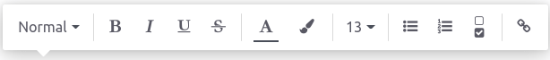

=================
Articles creation
=================

Get started
===========

In **Knowledge**, the pages on which you gather content are called *articles*. They are mainly
composed of a title and a body. The latter is an HTML field containing text, images, links to
other articles, records from other models, templates, etc. To create, read, modify and delete
knowledge articles, you must be an internal database user.

Articles are organized into four categories:

- :guilabel:`Workspace`: They are available for all internal users in :guilabel:`can read` or
  :guilabel:`can write` access. Users can invite external users by granting them
  :guilabel:`can read` access.
- :guilabel:`Private`: They are only available for the owner.
- | :guilabel:`Shared`: They are available for the owner and the users with whom the owner has
    shared the articles. Meaning that they are not available for any user except those with access.
  | Users can share any articles with other internal users by granting them :guilabel:`can read`
    or :guilabel:`can write` access. They can also share articles with external users in
    :guilabel:`can read` access only.
  | For the current user, this section contains all the private articles they shared with someone
    and all the articles shared with them.
- :guilabel:`Favorite`: Any identified user can set an article they have access to as a favorite.
  Doing so is user-specific and has no impact on other users.

.. Future content
   .. note:: make redirection to "shareability" page to explain how to share

Add articles
------------

To create articles, click the :guilabel:`Create` button on the right side of the top bar or the
:guilabel:`+` button next to a category.

An article can have a parent and multiple children. Adding children to an article establishes a
hierarchy. In a hierarchy, the **root** articles are usually the topic of all the
articles below them. Adding levels to a hierarchy is not limited. To create a child article,
click the :guilabel:`+` button next to the parent-to-be article.

.. tip::  Shortcut the creation of same-level articles; press **alt** and **c** simultaneously on
          your keyboard.

Add and style content
---------------------

Now, start adding content. To do so, add the first-level heading (h1) at the top of the article,
press **enter**, and begin writing.

To automatically match your heading 1 and the article's name, click on :guilabel:`Untitled` on the
left side of the top bar. Doing so synchronizes the *Untitled article* and the heading.

.. note:: This method only works one time. To modify your article's name, later on, you have to
   change it manually. To do so, select the article, click on the name on the top bar and proceed to
   the modification.

Use the Odoo editor
~~~~~~~~~~~~~~~~~~~

To open the text editor, select the text you want to format, and the editor appears. Then, click on
the buttons to change the text style (normal, heading 1 --> 6, code, quote), the format (bold,
italic, underlined, strikethrough, no format), the font and background colors, and the font size.
You can also create lists and insert (or edit) links.

To format a whole paragraph, type `/` anywhere in the text. Doing so opens the
:doc:`powerbox <../../../developer/reference/frontend/odoo_editor>`, which allows:

- Changing a paragraph into lists (bulleted, numbered, checkboxes)
- Changing a paragraph into headings (1 --> 6), normal text, `code`, or *quotes*.

Add a cover
-----------

You can customize your article by adding a cover pic and an icon. Hover above heading 1, and click
on :guilabel:`Add Cover`. A pop-up window opens to set a cover picture.

If your database and your Unsplash account are linked, the cover pic is automatically selected
based on the article's name. To modify it, hover over the pic to make the buttons appear, click on
:guilabel:`Change Cover` and select another image.

Retrieve images from different sources:

- Search the **Unsplash** database.
- Enter a picture's URL.
- Upload an image from a computer.

.. tabs::
   .. tab:: Source: Unsplash

      Type your keywords in the search bar, then click on the chosen image. To generate more
      results, click on :guilabel:`Load More` and load more pictures.
   .. tab:: Source: URL

      To add a picture by URL, click on :guilabel:`ADD URL` and type (or paste) the picture URL.
   .. tab:: Source: Upload

      To Upload an image directly from your computer, click on :guilabel:`UPLOAD AN IMAGE`, select
      an image, and click on :guilabel:`open`.

To remove the cover, hover over it to make the buttons appear and click on :guilabel:`Remove Cover`.

.. note::

   - To link Unsplash to your database, please refer to
     :doc:`../../websites/website/optimize/unsplash`
   - The articles are responsive, and so are the cover pictures. As a result, the images cannot
     be repositioned manually to fit a particular screen, as they are automatically resized
     depending on the device.

Add an icon
-----------

To add an icon, hover above heading 1 and click :guilabel:`Add Icon`. Doing this sets a random emoji
automatically. To change it, click it and select one from the emoji window. To remove it, proceed
equally and click the red circled :guilabel:`x`.

.. note::

   - The emoji is also displayed before the corresponding article in the side panel hierarchic tree.
   - Click the emoji on the side panel to change it without opening the related article.

Use shortcuts
=============

To use a shortcut, type `/` and open the :doc:`powerbox <../../../developer/reference/frontend/odoo_editor>`.
You can select from multiple shortcuts to insert blocks, images, files, etc. Some of them, such as
`/Image` (to insert an image), `/Article` (to insert a link to an existing article), are common to
all the apps. However, some shortcuts are inherent to the knowledge app and cannot be found or used
in any other application.

List of Knowledge-specific shortcuts
------------------------------------

.. list-table::
   :widths: 30 70
   :header-rows: 1
   :stub-columns: 1

   * - Shortcuts
     - Uses
   * - :guilabel:`/Table of Content`
     - Add a table of content with the article's headings.
   * - :guilabel:`/Index`
     - Show the first level of nested articles.
   * - :guilabel:`/Outline`
     - Show all nested articles.
   * - :guilabel:`/Item Kanban`
     - Insert a kanban view of article items.
   * - :guilabel:`/Item List`
     - Insert a list view of article items.
   * - :guilabel:`/File`
     - Embed a file that can be downloaded.
   * - :guilabel:`/Template`
     - Add a template section that can be inserted in messages, terms & conditions, or description
       in other applications.

Properties
==========

Properties are fields containing data and that can be added to articles by any user with
:guilabel:`can write` access. These fields are shared between all the child articles or article
items that are under the same parent.

.. note::
   To be able to add properties, an article must be either a **child article** or an **article
   item** in a **kanban or list view**.

Add property fields
-------------------

Hover above heading 1 to make the buttons appear. Click on :menuselection:`⚙️Add Properties -->
Field Type`, select the type and add a default value if needed. To make the fields appear in kanban
views, check :guilabel:`View in Kanban` as well. To validate and close the property creation
window, click anywhere.

.. image:: articles_creation/property-fields.png
   :align: center

.. list-table::
   :widths: 30 70
   :header-rows: 1
   :stub-columns: 1

   * - Types
     - Uses
   * - :guilabel:`Text`
     - Allows adding any content with no restriction.
   * - :guilabel:`Checkbox`
     - Add a checkbox.
   * - :guilabel:`Integer`
     - Allows adding integer numbers.
   * - :guilabel:`Decimal`
     - Allows adding any number.
   * - :guilabel:`Date`
     - Allows selecting a date.
   * - :guilabel:`Date & Time`
     - Allows selecting a date and time.
   * - :guilabel:`Selection`
     - | Add a drop-down selection menu with restricted values that have been set at the property
         creation.
       | To set it up, click :menuselection:`Add a property --> Field Type --> Selection -->
         Add values --> Enter predetermined values --> Press enter to validate --> repeat --> Click
         anywhere to close the property creation window`. You can enter as many values as needed.
   * - :guilabel:`Tags`
     - | Allows creating as many tags as needed. You can choose from already created tags, or create
         new ones by typing them and pressing **enter** or clicking on
         :guilabel:`Create "new_tags"`.
       | To set it up, click in the field next to :guilabel:`Tags` and :menuselection:`enter your
         "new_tag" --> Create "new_tag"` or :menuselection:`press enter --> click anywhere to close
         the window --> add "new_tag"` in the property field.
   * - :guilabel:`Many2one`
     - | Choose from a list of records that result from a model's domain. You can only select
         one result.
       | To set it up, click :menuselection:`Choose a model --> filter the results or show all
         records --> choose from those results`.
   * - :guilabel:`Many2many`
     - | Choose from a list of records that result from a model's domain. You can select as
         many results as needed.
       | To set it up, click :menuselection:`Choose a model --> filter the results or show all
         records --> choose from those results`.

Hide properties
---------------

To hide the property sidebar panel, click the :guilabel:`gear (⚙)` button.

Remove articles
===============

Articles can be deleted or archived.

To delete an article, click the :menuselection:`vertical ellipsis button (⋮) --> Delete`. The
article is moved to the :guilabel:`Trash` for 30 days before being permanently removed. To reinstate
it, go to :menuselection:`Open the Trash --> Select the article --> Remove from Trash`.

To archive an article, click :menuselection:`Search --> select the article or articles --> Action
--> Archive --> OK`. To retrieve an archived article, go to :menuselection:`Search --> Filters -->
Add Custom Filter --> open drop-down menu --> Active --> is Yes --> is No --> Apply`
